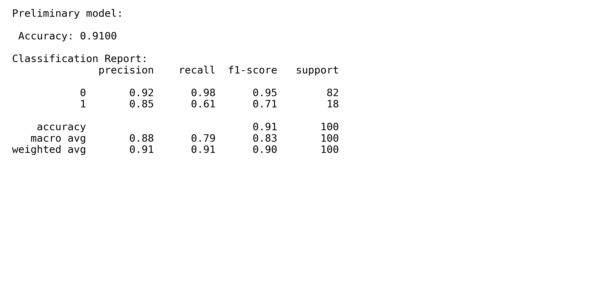
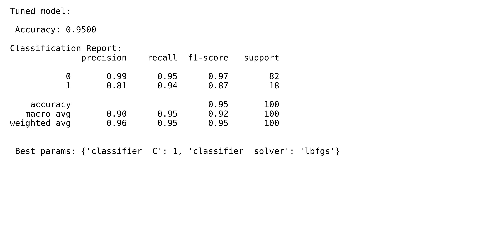

# Job-Fit Prediction Model

Implements logistic regression to predict whether a candidate is a good fit for a job post based on skills, experience, and education.

---

## Project Structure

- `data/` — dummy data generation  
- `model_training/` — model training and tuning scripts  
- `results/` — output files with evaluation metrics and best parameters

---

## Results

